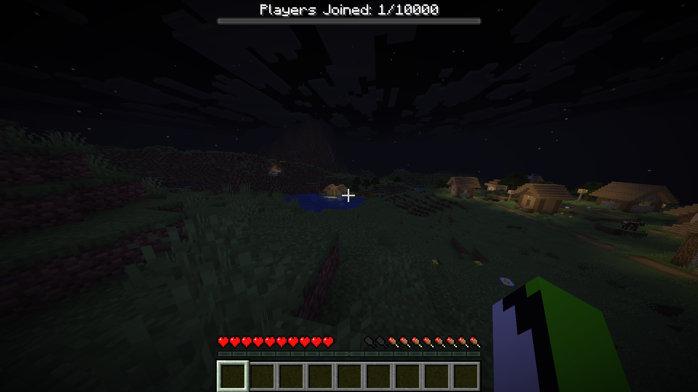

# Players Joined Counter — Forge 26.2

This mod displays a Minecraft boss bar at the top of the screen: `Players Joined: X/10000`.
The counter tracks unique players and is saved in `config/players_joined.txt`.

# Informations 

Your server need to be an Forge 26.2, and you already have all the source code, so if you have some problem ask AI please, i don't want to be asked for an AI, can litteraly say the problems in 1 mins.

## Installation 

1. Compile the project using Java 25 and `gradlew build`.
2. Take the `players-joined-1.0.0.jar` file.
3. Install Forge 26.2 on both the server and the client.
4. Place the `.jar` file in the server's `mods` folder.
5. Restart the server.

